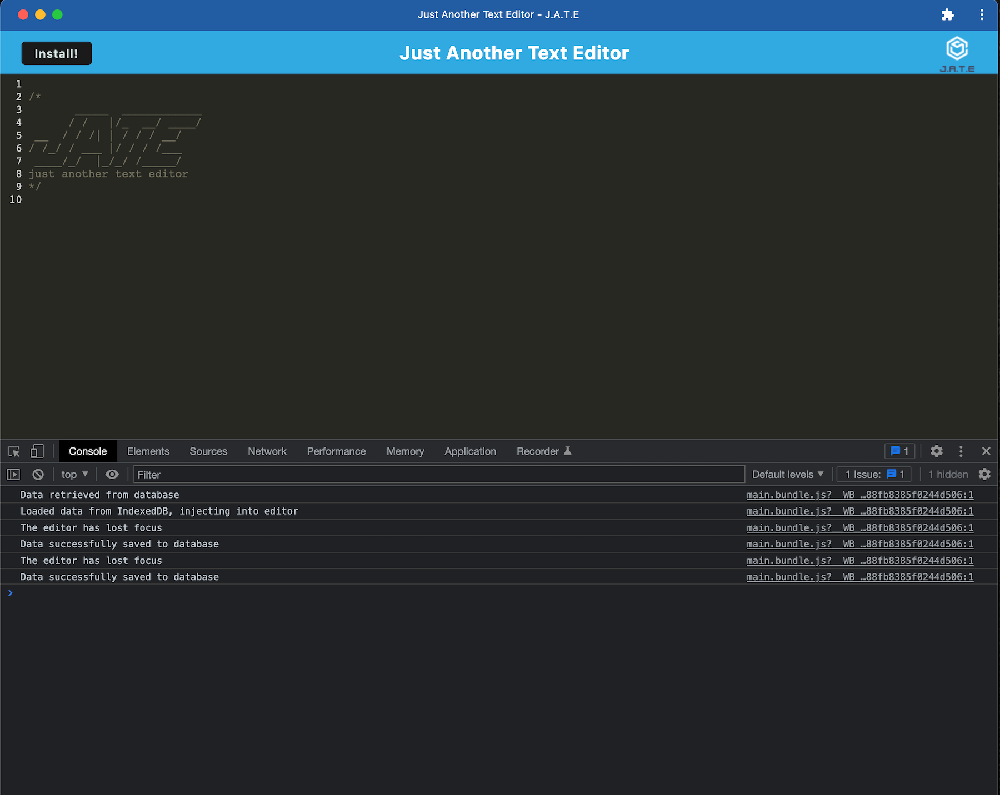
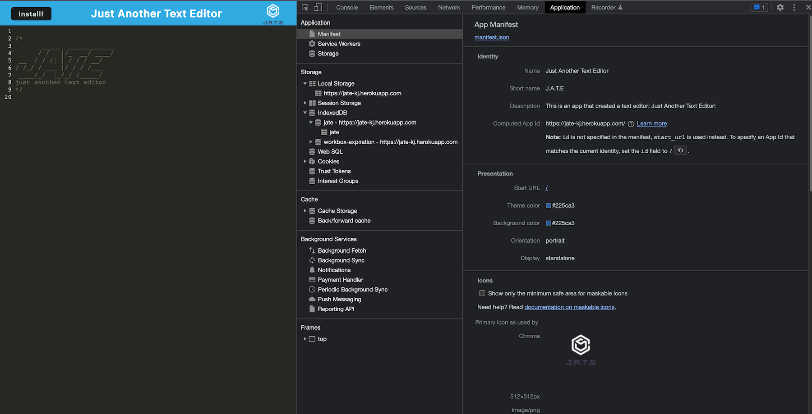
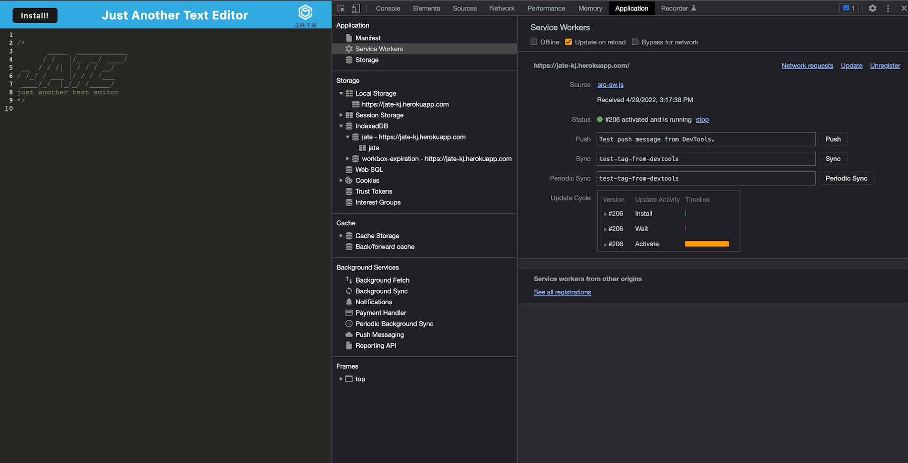
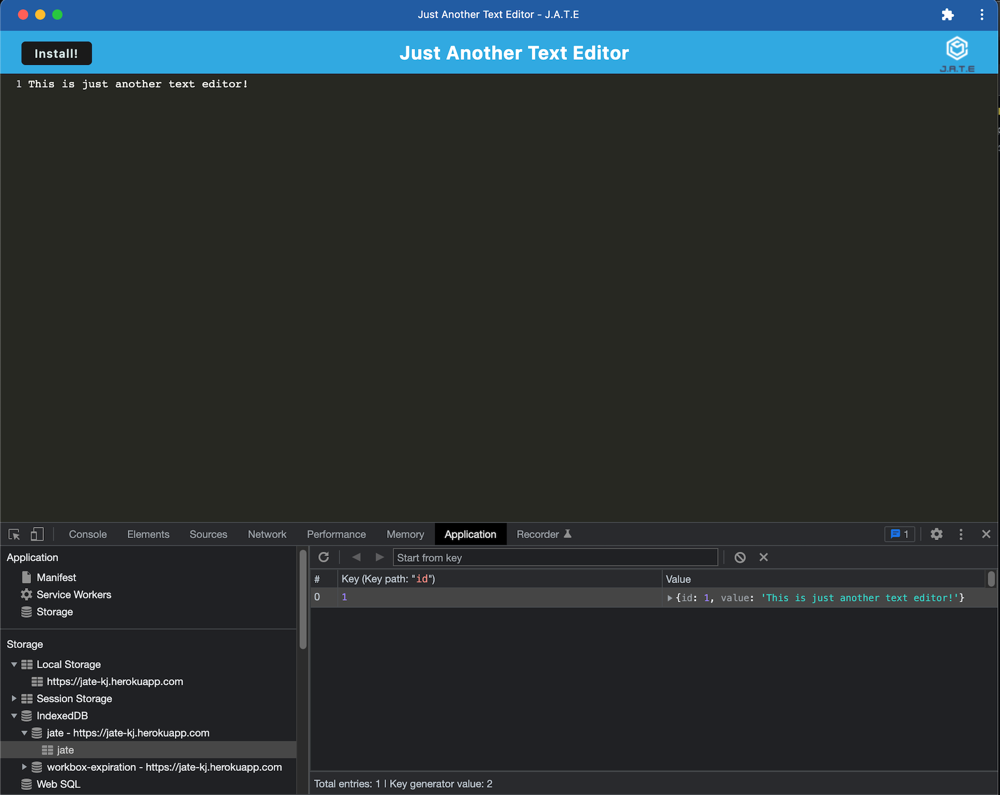

# text-editor (Just Another Text Editor)

------
## Table of Content

- [Description](#description)
- [Usage](#usage)
- [Images](#images)
- [Deployed Link](#deployed-link)
- [GitHub Repository](#github-repository)
- [Author](#author)  
- [Technologies Used](#technologies-used) 
- [License](#license)

------
## Description:  

J.A.T.E was created as a simple text editor app that can function both online and offline, with a variety of data persistence options in order to ensure that data is not lost in any scenario. The application first looks to use the data in the indexedDB to populate the editor, then if it cannot access that it will use local storage. For use offline, this application can be downloaded to your desktop as an application.

------
## Usage:

To use this app go to the link provided below.  For offline use, go to the link and hit the "install" button to install the app locally, for offline use.

------
## Images:

The following image shows the application retrieves database, injecting to editor, and successfully saving to DB.:

The following image shows the application's `manifest.json` file:

The following image shows the application's registered service worker:

The following image shows the application's IndexedDB storage:

------
## Deployed Link:

- [Heroku Deployed: Text Editor (Just Another Text Editor)](https://jate-kj.herokuapp.com/)

## Github Repository:

- [Github Repository for Text Editor](https://github.com/ksjefferies/text-editor)

## Author:

- [Kelly Jefferies](https://github.com/ksjefferies)

## Technologies Used:

- [Express.js](https://expressjs.com/)
- [Node.js](https://nodejs.org/en/)
- [Javascript](https://developer.mozilla.org/en-US/docs/Web/Javascript)

## License:

